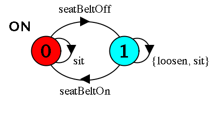
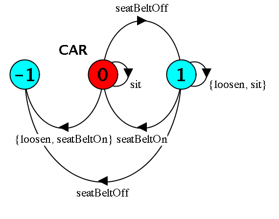
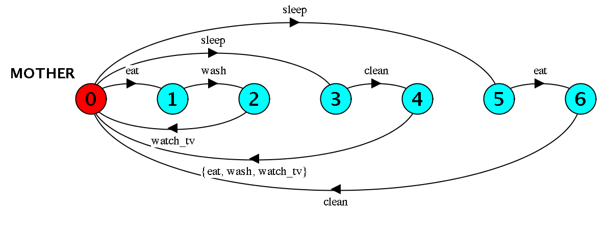
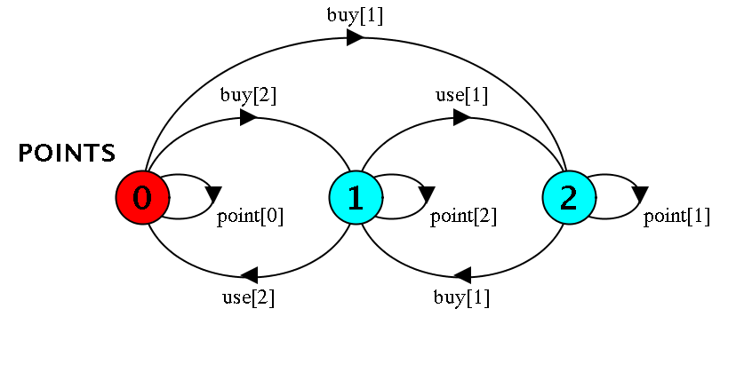
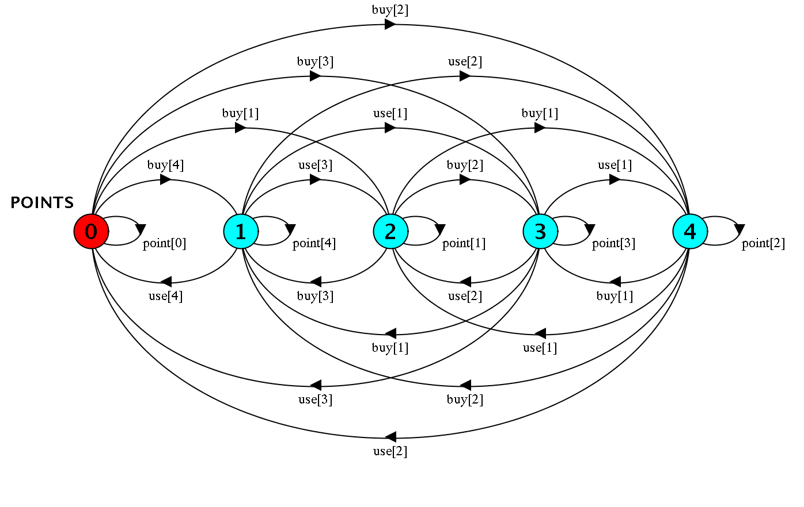

# Section A
### 1a)

By asynchronous we mean that processes proceed at arbitrary relative speeds and consequently their actions can be arbitrarily interleaved.

-- Extended answer (just for general knowledge):

When you execute something synchronously, you wait for it to finish before moving on to another task. When you execute something asynchronously, you can move on to another task before it finishes.

Synchronous (one thread):
```
1 thread ->   |----A-----||-----B-----------||-------C------|
```
Synchronous (multi-threaded):
```
thread A -> |----A-----|   
                        \  
thread B ------------>   ->|-----B-----------|   
                                              \   
thread C ---------------------------------->   ->|-------C------| 
```
Asynchronous (one thread):
```

         A-Start ---------------------------------------- A-End   
           | B-Start ----------------------------------------|--- B-End   
           |   |     C-Start -------------------- C-End      |     |   
           V   V       V                           V         V     V      
1 thread-> |-A-|---B---|-C-|-A-|-C-|--A--|-B-|--C--|---A-----|--B--| 
```
Asynchronous (multi-Threaded):
```

 thread A ->     |----A-----|
 thread B ----->     |-----B-----------| 
 thread C --------->     |-------C----------
 ```
 http://stackoverflow.com/questions/748175/asynchronous-vs-synchronous-execution-what-does-it-really-mean
 
 bi)
 
 ```
const N = 4
range T = 0..N

CYCLE = CYCLE[0],
CYCLE[v:T] = (when(v<N)in[v] ->CYCLE[v+1]
			 |when(v==N)in[v] -> CYCLE[0]).

 ```
 
### bii)
 ```
CARD = (count[i:1..5] -> COUNT[i]),
COUNT[i:1..5] = (when i==2 win -> STOP).
 ```
 
###  biii)
 ```
TEA = PACKS[3],
PACKS[i:0..3] = (when i > 1 double_packs -> PACKS[i-2]
				|when i > 0 pack -> PACKS[i-1]
				|when i == 0 buy -> PACKS[3]
				|packs[i] -> PACKS[i]).
 ```
 
 ### c)
 
 
 
 
 
### 2a)

The wait method has two purposes:

1. It will tell the currently executing thread go to sleep (not use any cpu).
2. It will release the lock so other threads can wake up and take the lock.

Whenever a method does something inside a synchronized block, whatever is in the block must wait for the locked object to be released.

### bi)



### bii)

Let's start with just const MAX = 2 to make things a bit more manageable:
```
const MAX = 2
POINTS = POINTS[0],
POINTS[i:0 .. MAX] = 
	( when (i< MAX) buy[j:1..MAX-i] -> POINTS[j+i]
	| when (i>1) use[j:1..i] -> POINTS[i-j]
	| point[i] -> POINTS[i]).

```

 
 
 Now for the granddaddy LTS:
 
 
 

### ci)

Process sharing ({a1,a2,...,an}::P):

{a1,a2,...,an}::P could be modelled as a:P and b:P but that would mean that they would be two distinct 
actions where in fact they are the same, so we have to use the notation: {a1,a2,...,an}::P

Process labelling (a:P)

a:P prefixes each action label in the alphabet of P with a

### cii)

```
const MAX = 2
VAR = VAR[0],
VAR[i:0..MAX] = (read[i] -> VAR[i] 
				|write[j:0..MAX] -> VAR[j]).

THREAD(N=1) = (write[N]->read[i:0..MAX]->STOP)+{write[i:0..MAX]}.

||PARALLEL = ( a:THREAD(0) || b:THREAD(1) || c:THREAD(2) || {a, b, c}::VAR)/{read/{a.read, b.read, c.read}}.
```

### 3a

```
Trace to terminal set of states:
	phil.0.sitdown
	phil.0.right.get
	phil.1.sitdown
	phil.1.right.get
	phil.2.sitdown
	phil.2.right.get
	phil.3.sitdown
	phil.3.right.get
	phil.4.sitdown
	phil.4.right.get
```

### bi
```

WAITER(S=4) = Seated[0],
  Seated[0] = ( sitdown -> Seated[1]),
  Seated[i:1..S-1] = ( sitdown -> Seated[i+1]
                          | arise -> Seated[i-1]),
  Seated[S] = (arise -> Seated[S-1]).

||SITTING(N=5) = ({phil[i:0..N-1]}::WAITER(N-1)).

PHIL = (sitdown->right.get->left.get
          ->eat->left.put->right.put
          ->arise->PHIL).

FORK = (get -> put -> FORK).

||DINERS(N=5)= 
   forall [i:0..N-1] 
   (phil[i]:PHIL 
   ||{phil[i].left,phil[((i-1)+N)%N].right}::FORK
   || SITTING(N)).

```

### ii)


### iii)

```
PHIL(L=0, R=1) = (sitdown->right.get->
		  (left.get
          ->eat->left.put->right.put
          ->arise->PHIL
		  |yield -> right.put -> arise -> PHIL)).

FORK = (get -> put -> FORK).

||DINERS(N=5)= 
   forall [i:0..N-1] 
   (phil[i]:PHIL 
   ||{phil[i].left,phil[((i-1)+N)%N].right}::FORK).

```


